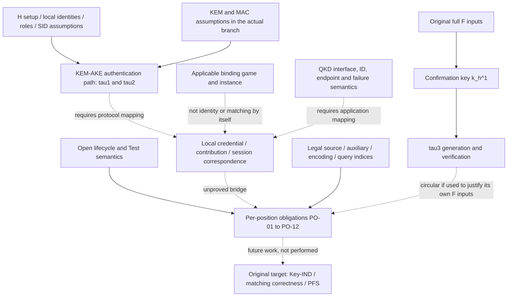

# M4：Proof obligation map and completion report

版本：2026-09-19。状态：M4_MAPPING_COMPLETE / G3-M4_REVIEW_PENDING。本轮只完成字段职责及证明义务映射，没有删除字段、修改 KDF、构造 reduced HAKE、选择首个变体、写 theorem、证明安全保持或运行攻击搜索/Tamarin。M5 未启动。

## 1. 阶段裁决与本轮边界

依据用户本轮“根据 chat 完成 M4”的授权，已读取 [AKE+QKD](https://chatgpt.com/c/6aa16049-8028-83e8-8631-f80883b2f2f7) 最新两轮：

- 审查轮 `277811d0-84e9-463e-a471-2fcf5ff87563`，回复 `e2cd71ca-e59d-4159-bd19-1fa629211941`：M3.2 baseline interpretation 审查通过；Accept/Test/erase 等开放项不阻塞**仅映射性质的 M4**。
- 任务轮 `b3819e64-09d4-4e32-b309-5f7e90d98a0f`，回复 `609ac748-ac47-43ac-b42e-6d28f255a210`：指定三份产物，只建立职责与证明义务，完成后等待 G3 审查。

上述内容作为用户指定的阶段决策依据，不作为密码学证据。不能将聊天中的示例性质或“审查通过”当作新 theorem。科学依据仍以原论文及明确引用为准。

本轮采用的工作合同是 final key secrecy、matching correctness、原 PFS 目标；authentication 沿用 H 的 SK/PFS 口径，不增加独立 identity/injective agreement。OI-01–OI-06、哈希接口、B1–B7 保留开放。**获准做映射 ≠ 完整可执行游戏已冻结 ≠ 四候选通过安全门槛。**

旧 `hybrid-branch-compatibility.csv` 的“未准入”继续表示候选未获安全/变体准入，不再被误读为禁止本轮描述性映射。本轮未改该表的结论。聊天所称 G3 在本文件标作 **G3-M4**（M4 映射交付审查）；原路线图 M5–M6 后的单字段 G3 保留原含义，二者均未通过。

## 2. 交付与可追溯关系

| 产物 | 覆盖 |
|---|---|
| [field-security-mapping.csv](field-security-mapping.csv) | 18×8；11 个 context 位置，加 7 个保护范围内依赖项 |
| [binding-property-analysis.md](binding-property-analysis.md) | 身份、credential、ephemeral、secret、QKD 五类职责；本地值、精确游戏、时点、故障边界 |
| [m4-proof-obligation.md](m4-proof-obligation.md) | 本文件；共同与逐位置义务、依赖图、Gate 问答及停止条件 |

Source 列给原文定位；Gap 列的 PO 编号对应 §4。表中“Security Property”是候选辅助性质，不自动改变主目标。k1/k1′、k2/k2′、k_A*/k_B*、k_qkd^A/k_qkd^B 的本地读法见分析 §2；不在一般执行中假定两侧相等。

## 3. 所有位置共同的证明义务（未执行）

| ID | 未来必须回答的问题 | 关联开放项 |
|---|---|---|
| U1：目标与时序 | 对应 H 哪项原性质、哪类会话和程序点？需要的 Accept/Complete/Test/Expire 规则是否已有来源或明确补充假设？ | OI-01/02/03 |
| U2：合法执行域 | 替代性质的实例、生成域、PPT/QPT、HON/LEAK/MAL 与 H 允许查询是否匹配？不能靠禁止原有查询取得结果 | OI-04/06；B5/B6 |
| U3：source 接口 | secret/context/α 如何合法对应，哪些值对攻击者可见？不能把秘密 context 当公共消息，不能循环假定 baseline 已安全 | B1/B3 |
| U4：多会话与编码 | matching 两端、非匹配会话、SID/角色、标签和长度如何映射；查询索引、别名、重复/相关输入是否保持所用 req | OI-05；B4 |
| U5：确认与最终 key | 在 τ1/τ2/τ3 可见及合法 Reveal 下，最终 k_h^2 的 Key-IND 如何衔接？不能仅凭输出切成两半就假定独立 | OI-01/02；B7 |
| U6：历史暴露 | 原 PFS 范围下仍存哪些材料、何时泄漏、哪些历史会话可挑战？不默认完美擦除，不升级 PCS | OI-03/04/06 |
| U7：hybrid 保持 | 在 BG/KO/QS/QB/QT 中分别使用了什么存活保证？新增 binding/预算是否缩窄原声明？不得在失效分支恢复假设 | B2/B6；既有分支表 |
| U8：非循环依据 | 支撑职责的保证是否已经依赖同一 context、原最终 key 安全或后置确认？若是，须独立论证而非复用原总结果 | 全部字段 |

这些是待审的证明任务，不是新 theorem。尤其“排除所有相同最终 key 的不同输入”可能比原 SK 目标更强，不应直接当作必要条件。应先明确哪些别名会影响 H 的 Key-IND、matching correctness 或 PFS；仅需哪些辅助约束由后续证明确定，本轮不自行选择。

开放项索引：OI-01 = Accept/Complete/Return；OI-02 = Test 与历史 key；OI-03 = Expire/Corrupt 顺序及范围；OI-04 = 泄漏后的控制行为；OI-05 = SID 唯一性域；OI-06 = 状态擦除。上述六项均未因允许 M4 映射而关闭。

## 4. 逐字段与出现位置的义务

### PO-01：A@c_KEM[1] 与 A@c_QKD[1]

- 分别识别本地 initiator 身份、预期 partner 以及 source endpoint 的关系；两处不是同一义务。
- 若未来仅研究其中一处，需证明剩余身份记录足以支持该处涉及的原性质；不能把另一个 source 的相同字符串当成不证自明的替代。
- τ1 的 A 是直接 MAC message 项；认证解释依赖 k1/k1′ 的合法性、CCA/MAC 路径、s 和 pk_e，不能从 hash 输入存在推出认证。
- 依赖：另一处 A、B 的有序位置、pk_a/pk_b setup、k1/k1′、τ1、s、QKD endpoint 映射。后续改变任一依赖须重审，尤其不得先用完美 identity binding 结束问题。
- 对应单元：BG/KO/QS/QB/QT 的 AG、SK、PFS；UK/KC 仅按既有原文讨论/机制层级记录。开放：U1–U8，尤其 OI-01/05。

### PO-02：pk_a@c_KEM[2]

- 若以 KEM 层保证作候选替代，需识别 k2/k2′ 到 pk_a 的精确 K-PK 游戏及其适用实例/攻击者域；C2PRI 不给跨公钥对应。
- 再证明 pk_a 与预期 A、会话角色和凭据来源的关系。不能由诚实 setup 推出所有身份的公钥单射，也不增加恶意注册接口。
- 解释 τ2 的认证 key 与凭据链，而不是宣称 τ2 message 含 pk_a。最终 key 相等不自动给出 k2 相等，必须处理跨层输入关联。
- 依赖：A、B、k2/k2′、ct2、s、τ2、setup、编码；τ3 若作为依据需过 U8。依赖项不在本轮改变。
- 对应单元：原 E03 引用的 AG/SK/PFS 和候选 N-SK；N-SK 仍未启用。特别审查 QB/QT；开放 OI-01/04/05/06。

### PO-03：B@c_KEM[3] 与 B@c_QKD[2]

- 分开 responder 身份关联、QKD endpoint 关联和 τ2 message 中的 B，不把它们当同一性质。
- 与 PO-01 类似地逐位置说明职责，但需按 Bob 的 τ2 验证方向检查；这不能推出 Alice 已验证 τ3。
- 依赖：另一处 B、A、pk_b/pk_a setup、k2/k2′、ct*、qkdKeyId、s、τ2。必要时需界定何种身份混淆影响原性质，而不是直接加入强 agreement。
- 对应单元：BG/KO/QS/QB/QT 的 AG/SK/PFS；开放 U1–U8，尤其 OI-01/05。

### PO-04：pk_b@c_KEM[4]

- 分别建立 k1/k1′ 与 pk_b、pk_b 与预期 B 的关系。τ1 使用 k1 类材料为 key，不等于直接认证 pk_b 字节。
- X-BIND-K-PK 若使用须匹配实际生成/泄漏域和计算能力；不能用 PK 绑定代替逻辑身份。
- 依赖：B、A、k1/k1′、ct1、s、pk_e、τ1、setup/编码。不能与 pk_a 路径联合处理而省略方向差异。
- 对应单元：原 E04 引用的 AG/SK/PFS 及未启用 N-SK。保持 QB/QT 禁止暗借计算 binding；开放 OI-01/04/05/06。

### PO-05：pk_e@c_KEM[5]

- 解释 Alice 接收到的 pk_e 的来源、Bob 本地 pk_e 与 sk_e 的一致关系，以及两端与 ct*、k_A*/k_B*、会话 s 的对应。
- 区分 τ1 验证支持的候选认证路径与 K-PK 的局部碰撞保证；两者的组合仍需 protocol-level proof bridge。
- 若使用 C2PRI，必须先说明其诚实挑战和固定 keypair 条件如何出现，且承认它本身不绑定不同 pk，不提供 matching 或 final-key 结论。
- 依赖：k1/k1′、τ1、s、A、pk_b/setup；k_A*/k_B*、ct*、sk_e 及擦除/暴露；τ2/B 与 source 模拟。
- τ3 同时含 pk_e 且其 key 依赖 F，不能直接拿原 τ3 的成功当作 F 前替代保证。QB/QT 中即使保留 τ1 消息，也不可无条件使用计算认证。
- 对应单元：E02 的 AG/SK/PFS 及未启用 N-SK；开放 OI-01/04/05/06、B1–B7。状态 requires validation，无省略判定。

### PO-06：k1/k1′@c_KEM[6]

- 保持认证 key、τ3 message、context 三种用途分离。不能以 τ1 验证通过就不经证明合并两角色的 k1。
- 证明所需的是 secrecy、consistency 还是某域内 uniqueness，必须明确；不能以 key independence 作为未定义的额外主目标。
- 依赖：pk_b/sk_b、ct1、pk_e、s、A、τ1、τ3 及 F/source/α。MAC 的普通 EUF-CMA 不直接给 key-committing 保证。
- 对应单元：AG/SK/PFS，涉及确认时仍尊重 KC 层级；B1、B4、B7 与 OI-04/06 未闭合。

### PO-07：k2′/k2@c_KEM[7]

- 逐角色追踪 τ2 的生成/验证 key、context 与 τ3 message，不预先设 k2′=k2。
- 解释 τ2 消息中的 qkdKeyId 和 ct* 如何与本地会话关联；源独立性不能被描述成完全无跨组件数据依赖。
- 依赖：pk_a/sk_a、ct2、B、s、ct*、qkdKeyId、τ2、τ3 及 F/source/α；保密、数值一致、唯一性分别证明。
- 对应单元：AG/SK/PFS；B1/B3/B4/B7 与 OI-04/06 未闭合。不是 PO-06 的无条件对称复制。

### PO-08：k*@c_KEM[8]（仅该 context 出现位置）

- 先说明同侧 σ_KEM 与该位置的重复事实如何进入所用 source/context 游戏；没有构造新的输入公式。
- 必须保持 σ_KEM 的秘密位置不变，且不能假设 k_A*=k_B* 在所有执行中成立。
- 未来需要证明合法 source/α、查询索引和别名处理、matching 完成正确性、在 τ3 可见下最终 Key-IND 及原 PFS；“重复不增加熵”不是这些结论的替代。
- 不把 C2PRI 当作自动许可；即使它可用于某密文对应子义务，仍不能给出整个 HAKE 结论。
- 依赖：k_A*/k_B* 的原秘密位置、pk_e、ct*、τ1/τ2、k1/k2 类材料、QKD 输入、固定 label/source order/输出拆分。
- 对应单元：E01 的全部 AG/SK/PFS 分支。B1 对另外两个秘密 context 仍存在，B2 余项和 QT 不会因重复位置消失；OI-01–OI-06 相关问题继续保留。

### PO-09：qkdKeyId@c_QKD[3]

- 证明接口返回 key、收到的 ID、配对 endpoint、HAKE 会话之间所需对应；不把 ID 一次使用与 key 数值永不碰撞混同。
- 若未来审查该位置，仍须原样保留 τ2/τ3、GetKey/GetKeyById、重复 ID 行为、⊥ 中止、QKD secret 和身份字段；本轮没有授权接口改变。
- 不能在 KEM 路径失效分支仍用 τ2 的计算认证；也不能通过只说 QKD 黑盒安全就跳过应用会话关联。
- 依赖：A/B 两个 context 视图、k_qkd^A/k_qkd^B、ct*、s、k2/k2′、τ2、τ3 与配对节点前提。
- 对应单元：AG/SK/PFS，重点 QS/QB/QT；开放 OI-03/05/06、B3/B4/B7。只分析接口边界，不做黑盒内部攻击。

### PO-10：两处 secret 输入（依赖登记，非省略对象）

σ_KEM 与 σ_QKD 为原 source 秘密输入。本轮不将其纳入 context 字段省略范围。需要的证明接口是各分支的合法 secret/α、源相关性、允许暴露与 PFS 生命周期；不以“秘密有用”证明其所有重复出现位置都具有必要性。

### PO-11：label、L/输出拆分、source order（保持不变）

固定全局 label、512-bit 输出、确认/最终 key 分工、KEM-first/QKD-second 位置。要建立相应域分离和查询模拟，不能由字段顺序直接推出独立性，也不把“分成两个位段”当独立随机 key 的证明。与 B3/B4/B7 相联，不在本轮改写编码或 F。

### PO-12：s 与 role（非独立 context 字段）

s=ct1∥ct2 在 τ1/τ2 message 和 H matching 中使用；role 是会话 tuple/处理方向，不是一个新添的 KDF 输入。需要明确 SID 编码和上层唯一性域、角色与本地消息的对应，但本轮不加入全局去重或 role tag。C2PRI/K-PK 不含 H 的 session/role 语义；OI-01/05 仍开放。

## 5. 证明依赖图与循环审查

箭头仅表示**未来论证需要的依赖**，不表示已证明的逻辑蕴含。实线是输入/流程或前提依赖，虚线是未建立的证明衔接。

| 循环风险 | 为什么不成立为独立依据 | 需要的后续处理 |
|---|---|---|
| context 进入 F → F 给确认 key → τ3 成功 → 据此判定同一 context 职责已由确认替代 | 使用了待解释输入参与产生的保证 | 独立前置对应论证，或明确的非循环联合归约；本轮不执行 |
| H 总 SK 声明 → 所有 context 都无关紧要 | 总声明适用于原完整协议，没有逐字段保持结论 | 与目标改动明确相关的 source/协议桥接 |
| 假设两端所有 k/身份视图相同 → context 不需要承担一致性职责 | 把候选职责直接放入前提 | 只在有来源的局部条件下使用相等，异常/合法泄漏分支另审 |
| 将秘密 context 置入公共 α → 复用既有 KDF 保证 | 可能改变对手可见秘密及 source 假设 | 先闭合 B1，不能以标记为“context”解决 |
| 证明某字段省略依赖另一字段 → 之后联合省略却沿用前一结论 | 依赖前提已变化 | 联合变化须新组合论证，本轮没有联合候选 |

## 6. M4 Gate 问答与完成判据

### Q1：哪些属于 cryptographic necessity？

可确认的是**原结构中** σ_KEM/σ_QKD 为 secret 输入，k1/k2 类材料用于认证，k_h^1 用于确认。这不证明某个 context 出现位置在所有等价协议中不可缺少。M4 未建立任何 context 字段的密码学必要性结论；要断言必要需明确模型并有相应证明或分离依据。

### Q2：哪些可能属于 explicit redundancy？

- k*@c_KEM[8] 存在同侧语法重复，是既有 E01 的候选动机；仅为 hypothesis。
- pk_e、pk_a、pk_b 可提出“已有认证/适用 binding 是否承担部分职责”的问题；不说明全部职责已覆盖。
- 相同身份在不同 source、同一 ID 在 MAC 与 context 中出现，不自动构成安全冗余。

均没有安全省略判定；保留 [hybrid-branch-compatibility.csv](hybrid-branch-compatibility.csv) 的证据不足结论。

### Q3：哪些无法替代？

现有 KEM binding 游戏本身不表达 HAKE 逻辑身份、角色、SID 或 QKD endpoint/检索状态，因而**不能单独充当这些职责的完整证明**。这不等于已经证明相应字段永远不可替代。A/B、qkdKeyId、label、状态规则在当前研究边界中保持不变；不作不可替代定理。

### Q4：后续 M5 应证明什么？

需由 G3-M4 审查先决定是否批准一个**位置明确、依赖清楚、分支范围明确**的研究对象。若批准，再确定未解决语义的使用方式，建立 U1–U8 与对应 PO 的非循环证明接口，并分别处理 matching correctness、final Key-IND 和原 PFS。不能直接开始套用 primitive 省略定理。

本轮只列待证接口，未形成 Candidate Reduced Context，未创建 candidate-01.md，也未选择或构造任何变体。旧路线图 M4.6/M4.8 的选型动作按最新聊天明确后置。

### 完成与停止状态

- 聊天指定三份映射产物：已完成。
- 原路线图 M4.1–M4.5：完成候选职责、参考游戏、时点、依赖及循环审查的登记；不代表性质已证。
- M4.7：维持保护范围；不新增操作。
- M4.6/M4.8：依最新范围后置，不伪造完成。
- G3-M4：等待审查；M5、原单字段 G3、安全保持证明均未通过/未启动。

结构校验仅验证行列、引用、位置覆盖、标签与文件边界；不构成密码学验证。来源 PDF、M0/M1 数据、M2 结论、原安全合同及四候选安全状态保持不变。

## 7. 本轮验证记录

- `scripts/validate-m4.ps1` 通过：18×8 映射、全部 11 个 context 位置且不重不漏、PO 引用、角色本地记号、六项开放问题、六类分支、本地链接与阶段停止边界。
- 原 M2/M3 校验通过，包括 10 个来源文件哈希及原合同状态。
- 表格工具重新导入 CSV，确认含表头 19×8、全部为文本且无意外公式；仅交付 CSV，不导出额外 workbook。
- `git diff --check` 通过；核对来源、M0/M1、M2、两张原合同表均无本轮改动。
- 现有安全模型、冻结提案/摘要、M3 结论与状态文档仅增加本轮阶段更新说明；路线图按聊天限定范围更新。没有 commit/push，没有生成变体或运行协议安全测试。
